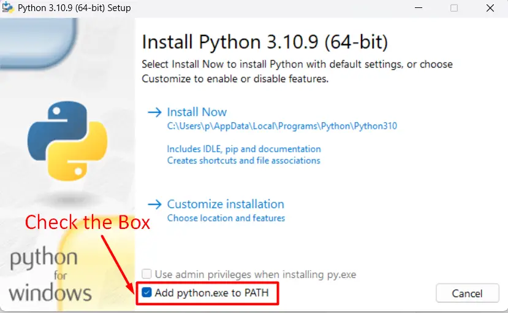

# Занятие 1. Введение. Установка ПО. Git.

1. [Установка ПО](#установка-по)
    1. [Установка ПО. Python](#установка-по-python-311)
    2. [Установка ПО. Git](#установка-по-git)
    3. [Установка ПО. IDE](#установка-по-vs-code--pycharm)
2. [GIT](#git)
    1. [Git. Основные команды](#git-основные-команды)
    2. [Git. Настройка SSH](#git-настройка-ssh)
3. [Задание](#задание)

## Установка ПО

Для занятий потребуется следующий набор программ и инструментов:
* Python 3.11
* Git
* IDE (VS Code / PyCharm)
* Jupyter Lab
* nbgrader

---

### Установка ПО. Python 3.11

#### Любая ОС

Скачать требуемую версию по ссылке: [Python](https://www.python.org/downloads/release/python-3121/) и установить.

Во время установки необходимо поставить галочку **Add python.exe to PATH**:



#### Linux (Ubuntu)

В терминале выполнить:

```console
sudo apt-get install python3.12
```

#### macOS

```console
brew install python3.12
```

### Установка ПО. Git

Следуйте [инструкции](https://github.com/git-guides/install-git).

### Установка ПО. IDE (VS Code / PyCharm)

Скачать актуальные версии IDE можно по ссылкам:
* [VS Code](https://code.visualstudio.com/download)
* [PyCharm](https://www.jetbrains.com/help/pycharm/installation-guide.html#standalone)

## Git

**Git** — распределённая система управления версиями. Проект был создан Линусом Торвальдсом для управления разработкой ядра Linux, первая версия выпущена 7 апреля 2005 года.

Не следует путать с GitHub, GitLab и Gitea — веб-сайтами для размещения git-репозиториев и совместной разработки проектов.

### Git. Основные команды

[Шпаргалка с основными командами по работе с Git](/materials/2-Git.md).

[Книга по работе с Git](https://git-scm.com/book/ru/v2/).


### Git. Настройка SSH

Используя протокол SSH, вы можете подключаться и проходить аутентификацию на удаленных серверах и службах. С помощью SSH-ключей вы можете подключаться к GitHub, не указывая свое имя пользователя и личный токен доступа при каждом посещении. Вы также можете использовать ключ SSH для подписи коммитов.

Вы можете получать доступ к данным и записывать их в репозитории на GitHub.com, используя SSH (протокол Secure Shell). Когда вы подключаетесь через SSH, вы проходите аутентификацию с использованием файла закрытого ключа на вашем локальном компьютере.

Когда вы настраиваете SSH, вам нужно будет сгенерировать новый закрытый ключ SSH и добавить его в агент SSH. Вы также должны добавить открытый ключ SSH в свою учетную запись на GitHub, прежде чем использовать его для аутентификации или подписания коммитов.

Процедуру создания нового ключа можно найти по ссылке: [Создание нового ключа SSH и его добавление в ssh-agent](https://docs.github.com/ru/authentication/connecting-to-github-with-ssh/generating-a-new-ssh-key-and-adding-it-to-the-ssh-agent)

Процедуру добавления ключа в аккаунт GitHub можно найти по ссылке: [Добавление нового ключа SSH в учетную запись GitHub](https://docs.github.com/ru/authentication/connecting-to-github-with-ssh/adding-a-new-ssh-key-to-your-github-account)

## Задание

1. Установить все необходимое ПО
2. Зарегистрироваться на [GitHub](https://github.com/)
3. Настроить информацию о пользователе на локальной машине 
    ```console
    git config --global user.name "[имя]"
    git config --global user.email "[адрес электронной почты]"
    ```
4. Настроить соединение с GitHub по SSH
5. Перейти по ссылке, принять разрешения для бота GitHub Classroom и принять задание. Для каждой группы своя ссылка:
    * [K0109-23-1]()
    * [K0109-23-2]()
    * [K0609-23-1]()
    * [K0609-23-2]()
6. Созданный для задания репозиторий клонировать на свою локальную машину. **Репозиторий создается уникальный для каждого студента!**

    Адрес можно найти нажав кнопку `Code` на странице репозитория

    
    ```console
    git clone [SSH-адрес]
    ```
7. Открыть локальный репозиторий в IDE (VS Code или Jupyter) и выполнить задание в файле.
8. Создать коммит и за-push-ить свое решение на GitHub
    ```console
    git commit -m "[сообщение с описанием]"
    git push
    ```